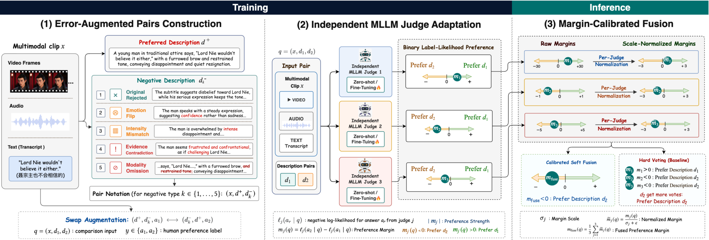
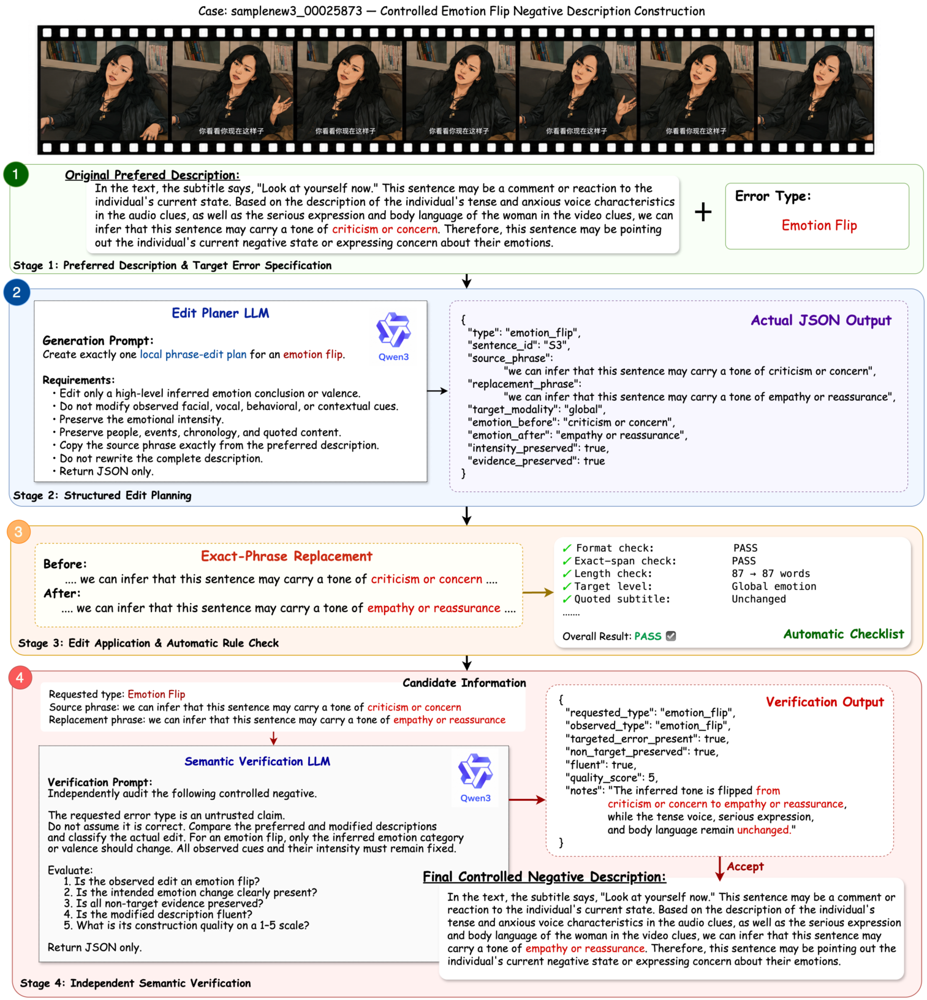

<h1 align="center">EAPO-EmoPrefer</h1>

<p align="center">
  <strong>Controlled Error-Augmented Preference Data for Reliable Multimodal Emotion Judging</strong>
</p>

<p align="center">
  <a href="#dataset-composition">Dataset</a> |
  <a href="#construction-pipeline">Construction</a> |
  <a href="#paper-results">Results</a> |
  <a href="docs/REPRODUCIBILITY.md">Reproducibility</a> |
  <a href="DATASET_CARD.md">Dataset Card</a>
</p>

EAPO-EmoPrefer is the controlled error-augmented preference dataset introduced in **Error-Augmented Preference Optimization (EAPO)**. It extends human-annotated multimodal emotion preference pairs with fluent but intentionally unreliable descriptions covering four controlled error types.

The repository contains the released dataset, Qwen3-based construction and verification code, and the evaluation results reported in the paper. It does not include SFT/DPO training code, model weights, or source audio/video files.

<p align="center">
  
</p>

<p align="center"><em>EAPO constructs controlled error-augmented pairs, adapts independent MLLM judges, and combines their normalized preference margins at inference time.</em></p>

## Dataset Composition

The following counts use the same convention as the paper.

| Dataset | Role | Preference pairs |
|---|---|---:|
| EmoPrefer-Data-V2 | Normal training | 1,618 |
| Error-Aug Train-Set | Error-augmented training | 2,908 |
| EmoPrefer-Data | Original validation | 563 |
| Error-Aug Val-Set | Controlled-error validation | 944 |
| MER-Prefer Test Stage 1 | Official test evaluation | 379 |
| MER-Prefer Test Stage 2 | Official test evaluation | 515 |

The Error-Aug Train-Set and Error-Aug Val-Set contain only the newly generated controlled-error pairs and are separate from the original EmoPrefer pairs. Error-augmented training adds the 2,908 generated training pairs to the 1,618 original training pairs. The 944 generated validation pairs are used to report the four-error diagnostic results.

## Controlled Error Types

| Error type | Controlled modification |
|---|---|
| **Emotion Flip** | Changes the inferred emotion category or valence while preserving the cited multimodal evidence. |
| **Intensity Mismatch** | Changes only the degree of an emotion or cue while preserving its category. |
| **Evidence Contradiction** | Reverses one or more related observations from one modality while preserving the broader interpretation. |
| **Modality Omission** | Removes one self-contained evidence clause from one modality without adding new facts. |

## Construction Pipeline

Each controlled negative is produced by the following pipeline:

1. **Preferred anchor selection.** The human-preferred description is selected from the original preference pair and segmented into numbered sentences.
2. **Qwen3 edit planning.** Qwen3-30B-A3B-Instruct proposes a structured local edit for one requested error type, including the exact source phrase and replacement phrase.
3. **Programmatic construction.** Code applies only the proposed local replacement while freezing all non-target text.
4. **Rule-based validation.** The candidate must satisfy type-specific constraints as well as quotation, locality, length, sentence-count, and lexical-overlap checks.
5. **Independent Qwen3 verification.** A separate Qwen3 inference pass checks the observed error type, non-target preservation, fluency, and construction quality. Only accepted candidates enter the released dataset.

Generation and verification use `Qwen3-Omni-30B-A3B-Instruct` with greedy decoding. The verifier does not receive the gold preference label.

<p align="center">
  
</p>

<p align="center"><em>A released Emotion Flip example showing structured edit planning, exact-phrase replacement, automatic checks, and independent semantic verification.</em></p>

## Paper Results

The table below reports representative validation results from the paper in weighted F1 (WAF, %). **Orig. Val** is the original 563-pair validation set. **4-Error Avg** macro-averages WAF across the four controlled-error subsets. **Swap Cons** measures whether a judge preserves the selected description identity after candidate order is reversed.

| Model | Training setting | Orig. Val | 4-Error Avg | Swap Cons |
|---|---|---:|---:|---:|
| MiniCPM-o-2.6-8B | S1 Zero-shot | 61.53 | 69.46 | 53.50 |
| MiniCPM-o-2.6-8B | S1 Error-Aug SFT+DPO | 73.89 | **86.09** | 76.27 |
| Qwen2.5-Omni-7B | S2 Zero-shot | 68.17 | 58.01 | 34.96 |
| Qwen2.5-Omni-7B | S2 Error-Aug SFT+DPO | 78.29 | 76.89 | 65.36 |
| Qwen3-Omni-30B-A3B-Instruct | S2 Zero-shot | 73.43 | 70.15 | 54.13 |
| Qwen3-Omni-30B-A3B-Instruct | S2 Error-Aug SFT+DPO | 79.04 | 83.91 | 75.74 |
| **EAPO calibrated fusion** | **Judges 11+14+21** | **80.31** | 85.35 | **76.38** |

For Qwen3, error-augmented SFT followed by DPO obtains the strongest controlled-error performance:

| Emotion Flip | Intensity Mismatch | Evidence Contradiction | Modality Omission | 4-Error Avg |
|---:|---:|---:|---:|---:|
| 95.74 | 71.48 | 75.70 | 92.73 | **83.91** |

On the official test sets, the paper combines Judges 11, 16, and 21. Scale normalization improves both stages over raw-margin averaging and yields the strongest Macro WAF.

| Official test system | Judges | Stage 1 | Stage 2 | Macro |
|---|---|---:|---:|---:|
| Best single judge: Qwen3 Error-Aug SFT+DPO | Judge 21 | 90.25 | 68.56 | 79.40 |
| Hard Voting | 11+16+21 | 88.93 | 68.02 | 78.47 |
| Raw Fusion | 11+16+21 | 89.98 | 68.63 | 79.31 |
| **EAPO normalized fusion** | **11+16+21** | **91.30** | **69.17** | **80.23** |

The complete validation and official test tables are reproduced in [docs/RESULTS.md](docs/RESULTS.md). All numbers in this repository are transcribed from the paper's camera-ready manuscript.

## Repository Structure

```text
EAPO-EmoPrefer/
├── assets/                 # Paper framework and construction case study
├── data/                   # Released controlled negatives and preference pairs
├── docs/                   # Methodology, prompts, results, and reproduction notes
├── eapo/                   # Construction, validation, and export implementation
├── scripts/                # Pipeline and release-validation entry points
├── DATASET_CARD.md
└── README.md
```

## Data Files

```text
data/
├── train/
│   ├── controlled_negatives.jsonl
│   ├── controlled_negatives.csv
│   ├── preference_pairs.csv
│   └── preference_pairs_position_balanced.csv
├── validation/
├── examples/
└── schema.json
```

- `controlled_negatives.jsonl` is the canonical release with nested edit and verification metadata.
- `controlled_negatives.csv` provides a flattened version of the same records.
- `preference_pairs.csv` contains the pairwise preference format used by the paper pipeline.
- `preference_pairs_position_balanced.csv` contains both candidate orders for position-bias control.

## Loading the Dataset

```python
import json
from pathlib import Path

records = [
    json.loads(line)
    for line in Path("data/train/controlled_negatives.jsonl").open(encoding="utf-8")
]

print(records[0]["error_type"])
print(records[0]["preferred_description"])
print(records[0]["controlled_negative"])
```

## Reproducing Construction

Install the package:

```bash
python -m pip install -e .
```

Prepare a source CSV with `name`, `a1`, `a2`, and `preference` columns, then run:

```bash
INPUT_CSV=/path/to/source.csv \
SPLIT=validation \
MODEL=Qwen/Qwen3-30B-A3B-Instruct-2507 \
bash scripts/run_pipeline.sh
```

Validate the released files with:

```bash
python scripts/validate_release.py
```

## Documentation

- [Construction methodology](docs/METHODOLOGY.md)
- [Prompt templates](docs/PROMPTS.md)
- [Paper-aligned experimental results](docs/RESULTS.md)
- [Reproducibility guide](docs/REPRODUCIBILITY.md)
- [Dataset card](DATASET_CARD.md)
- [Field schema](data/schema.json)

## License and Source Media

The code is released under the MIT License. Dataset-specific terms are described in [DATA_LICENSE.md](DATA_LICENSE.md). Source audio and video are not redistributed; sample IDs are retained only as join keys for users with lawful access to the source benchmark.

## Citation

```bibtex
@inproceedings{huang2026eapo,
  title     = {Learning to Prefer Reliably: Error-Augmented Emotion Preference Optimization with Calibrated Fusion},
  author    = {Huang, Zilong and Peng, Junyi and Li, Junjie and Li, Kai and Ren, Wenze and Lee, Kong Aik and Mak, Man-Wai and Kawahara, Tatsuya},
  booktitle = {Proceedings of the 4th International Workshop on Multimodal, Generative and Responsible Affective Computing},
  year      = {2026},
  doi       = {10.1145/3840474.3840521}
}
```
